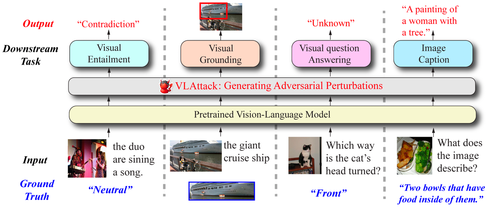

**VLAttack**: Multimodal Adversarial Attacks on Vision-Language Tasks via Pre-trained Models
=======



😎This is an official repository of [VLAttack: Multimodal Adversarial Attacks on Vision-Language Tasks via Pre-trained Models](https://arxiv.org/pdf/2310.04655.pdf) by Ziyi Yin, Muchao Ye, Tianrong Zhang, Tianyu Du, Jinguo Zhu, Han Liu, Jinghui Chen, Ting Wang and Fenglong Ma.

## Release
- We now release the attacking codes of the [BLIP](https://proceedings.mlr.press/v162/li22n/li22n.pdf) and [CLIP](https://arxiv.org/pdf/2103.00020.pdf) models [12/10]. More codes for attacking different models are coming soon!
## Installation

To recreate the environment, run the following command:

```bash
$ conda env create -f environment.yaml
$ conda activate VLAttack
$ pip install torch==1.10.0+cu111 torchvision==0.11.0+cu111 torchaudio==0.10.0 -f https://download.pytorch.org/whl/torch_stable.html
```

## Evaluation
We independently constructed codes for attacking each model. For example, if you want to test `VLAttack` on the BLIP model, you need first enter the corresponding directory:
```
cd BLIP_attack
```
and then run the commands according to the [README.md](https://github.com/ericyinyzy/VLAttack/blob/main/BLIP_attack) in the directory.

## Citation
```
@InProceedings{VLAttack,
author = {Ziyi Yin and Muchao Ye and Tianrong Zhang and Tianyu Du and Jinguo Zhu and Han Liu and Jinghui Chen and Ting Wang and Fenglong Ma},
title = {VLAttack: Multimodal Adversarial Attacks on Vision-Language Tasks via Pre-trained Models},
booktitle = {NeurIPS},
year = {2023}
}
```
## License
VLAttack is released under BSD 3-Clause License. Please see [LICENSE](LICENSE) file for more information.


## Acknowledgements

[BLIP](https://github.com/salesforce/BLIP)

[CLIP](https://github.com/openai/CLIP)

[Cleverhans](https://github.com/cleverhans-lab/cleverhans)
